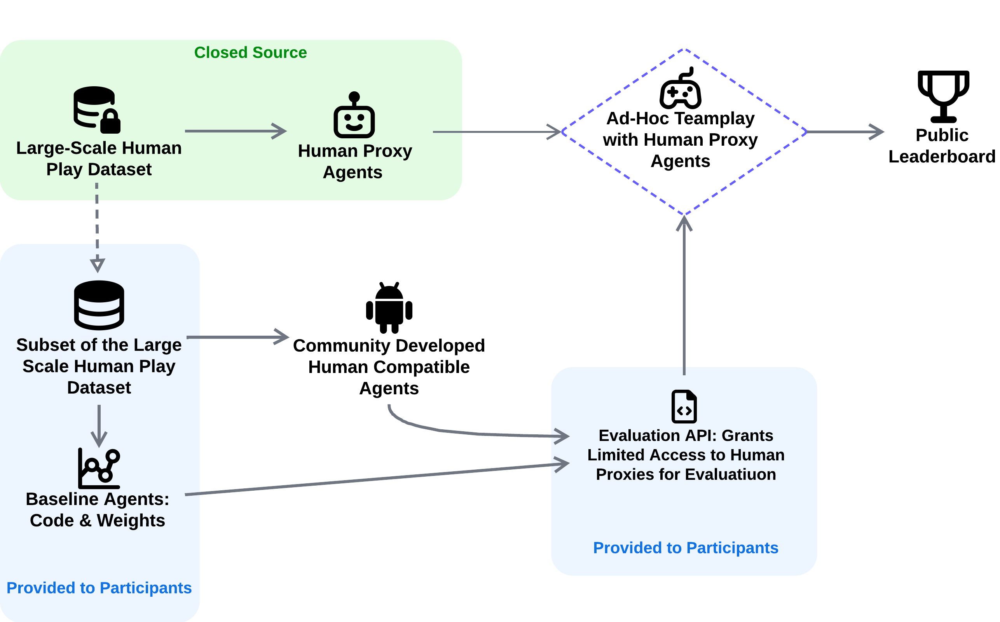

# Ad-Hoc Human-AI Coordination Challenge (AH2AC2) 🚀

📌 **Register for the Challenge:** [ah2ac2.com](https://ah2ac2.com)  
🏅 **Public Leaderboard:** [ah2ac2.com](https://ah2ac2.com)  
📄 **Research Paper:** _Link to Paper Coming Soon!_  
📚 **Docs:** [docs.ah2ac2.com](https://docs.ah2ac2.com)


Welcome to the Ad-Hoc Human-AI Coordination Challenge (AH2AC2)! 
The objective of AH2AC2 is to facilitate the development of AI agents capable of effective collaboration with human-like partners, especially in scenarios with limited prior interaction data. 
AH2AC2 is designed to benchmark and drive progress in this area.

<p align="center">
  
</p>

## Dataset 📂

To download the dataset required for the challenge, simply run the following script:

```bash
python ah2ac/datasets/download_dataset.py
```

This will download all necessary data into the `ah2ac/datasets/data` directory, organizing everything you need to get started with the challenge.

## Usage 🛠️

We highly recommend using Docker to run our implementation for a consistent environment setup. To get started, use the provided `Dockerfile`.
This will spin up the required environment for you to run the experiments and simulations for the challenge.

## Baselines 🏆

To download the weights for our baselines the challenge, run the following script:
```bash
python ah2ac/models/download_models.py
```

Evaluation for baseline agents can be found in the `ah2ac2/baselines` directory.

All training scripts are located in the `ah2ac2/training` directory.


### Docs

If you want to run the docs locally for whatever reason:
```
docker build -f docs.Dockerfile -t ah2ac2-docs .
docker run -p 8000:8000 -v .:/docs ah2ac2-docs
```

